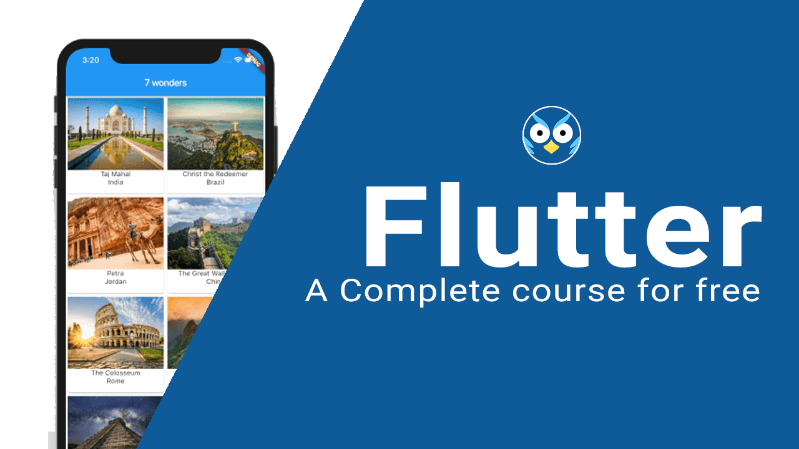

---
# Feel free to add content and custom Front Matter to this file.
# To modify the layout, see https://jekyllrb.com/docs/themes/#overriding-theme-defaults
title: A Complete Flutter Tutorial for Free
layout: default
nav_order: 1
menu_title: Welcome
image: assets/images/cover/complete-flutter-course.png
---

# Welcome to FlutterOwl.com

**What is Flutter?**

Flutter is a Google's portable UI toolkit for building beautiful, natively-compiled applications for mobile, web, and desktop from a single codebase.

**Why FlutterOwl.com**

FlutterOwl.com helps you to learn flutter for **FREE** with downloadable examples. We have created this sites for learning flutter with **step by step tutorial**

**Useful Websites**
- Official Website: [Flutter.dev](https://flutter.dev)
- Flutter Package: [pub.dev](https://pub.dev/)